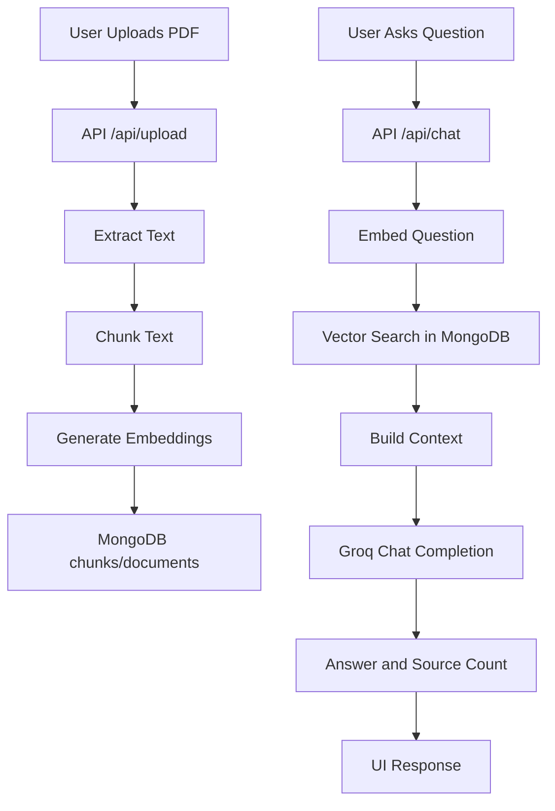
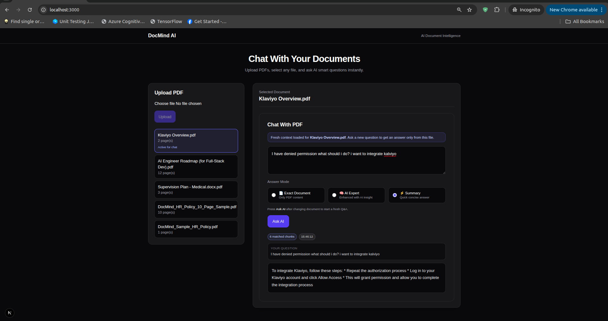
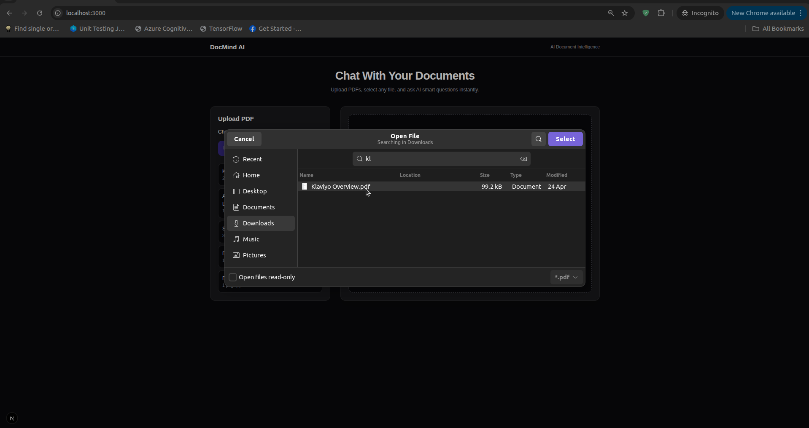
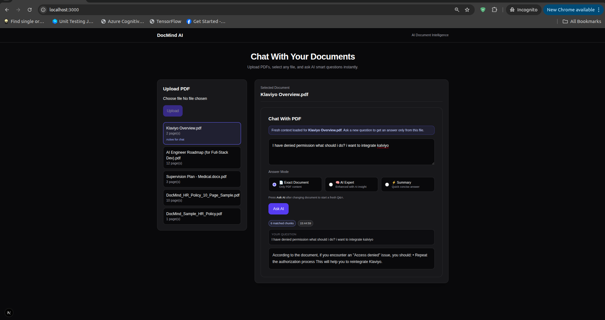
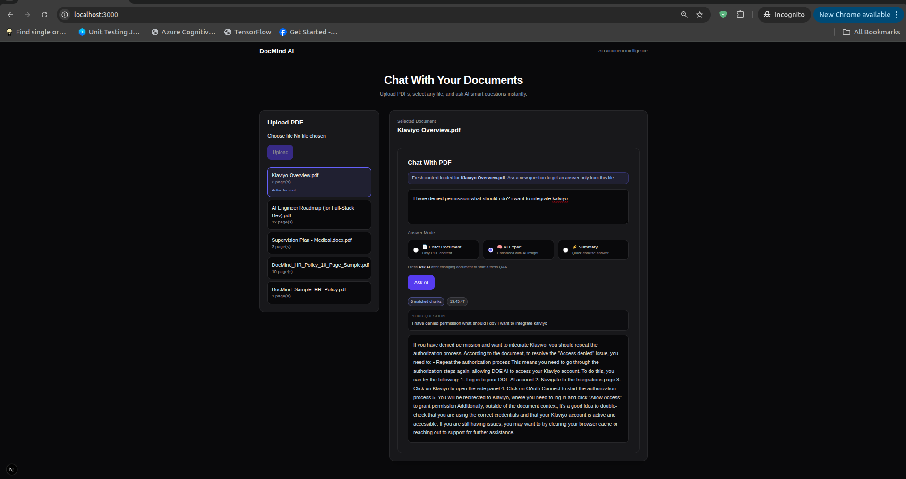

# DocMind AI

## Project Overview
DocMind AI is an AI-powered document intelligence platform for uploading PDF files, indexing their content with vector embeddings, and answering user questions with retrieval-augmented generation (RAG).

Business purpose:
- Reduce manual document review time
- Enable fast, context-grounded Q&A over internal documents
- Provide a production-ready base for document copilots and knowledge assistants

Core functionality:
- PDF upload and text extraction
- Chunking and embedding generation
- Vector similarity search in MongoDB
- Contextual answer generation via Groq LLM

## Features
- Upload and process PDF files
- Persistent document catalog
- Multi-mode answer behavior:
  - `strict`: grounded to document context
  - `expert`: document-first with additional expert guidance
  - `summary`: concise response mode
- Health check endpoint for service status

## Tech Stack
Frontend:
- Next.js 16 (App Router)
- React 19
- Tailwind CSS 4

Backend:
- Next.js Route Handlers (`app/api/*`)
- TypeScript

Database:
- MongoDB (documents + chunks collections)
- MongoDB Vector Search (`$vectorSearch`)

Authentication:
- Not implemented in current repository

AI/LLM:
- Groq API (`groq-sdk`) for chat completions
- `@xenova/transformers` (`all-MiniLM-L6-v2`) for embeddings

Infrastructure:
- Node.js runtime (Next.js server)

Storage:
- MongoDB (metadata, extracted text, embeddings)

## System Architecture
1. User uploads a PDF from the web client.
2. `/api/upload` extracts text (`pdf-parse`), stores document metadata, chunks text, computes embeddings, and stores chunks in MongoDB.
3. User asks a question from the selected document.
4. `/api/chat` embeds the question, runs `$vectorSearch` on chunk embeddings, builds context, and sends prompt to Groq.
5. API returns grounded answer and source chunk count.

## Project Workflow
- Upload Workflow:
  1. Select PDF in UI
  2. Submit to `/api/upload`
  3. Persist document + chunks
  4. Refresh document list
- Q&A Workflow:
  1. Select uploaded document
  2. Ask question in chosen mode
  3. Retrieve relevant chunks by vector similarity
  4. Generate answer from context
  5. Render answer and source count

## Flow Diagram


## Installation Guide
1. Clone repository:
```bash
git clone <repo-url>
cd docmind-ai
```
2. Install dependencies:
```bash
npm install
```
3. Configure environment variables:
```bash
cp .env.example .env.local
# fill in real values
```
4. Run development server:
```bash
npm run dev
```
5. Build for production:
```bash
npm run build
npm run start
```
6. Lint:
```bash
npm run lint
```

## Environment Variables
Required:
- `MONGODB_URI`: MongoDB connection string
- `DB_NAME`: target MongoDB database name
- `GROQ_API_KEY`: Groq API key for LLM calls

Optional:
- `GROQ_MODEL`: chat model override (default: `llama-3.3-70b-versatile`)

## Third-Party Services
- Groq API
- MongoDB Atlas (or compatible MongoDB deployment with Vector Search)

## Scripts
- `npm run dev`: start local dev server
- `npm run build`: build production bundle
- `npm run start`: run production server
- `npm run lint`: run ESLint

## System Interface Preview
Main system screens are shown below:

### 1. Main Dashboard


### 2. File Upload Selection


### 3. Q&A Interaction


### 4. Expert Mode Response


